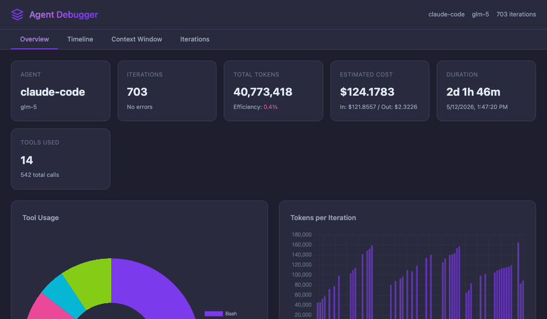
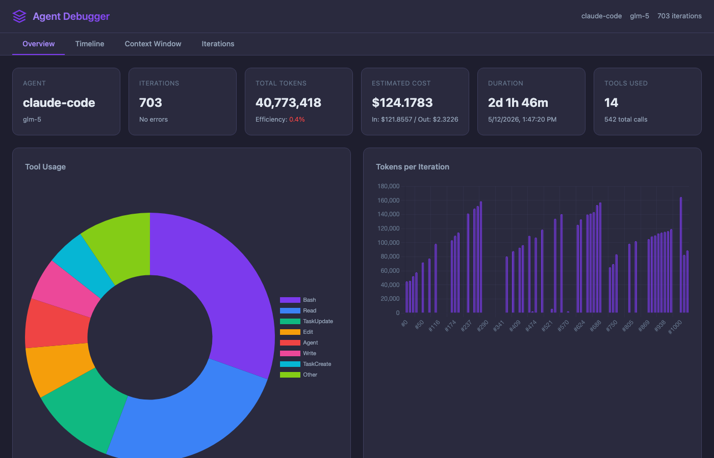
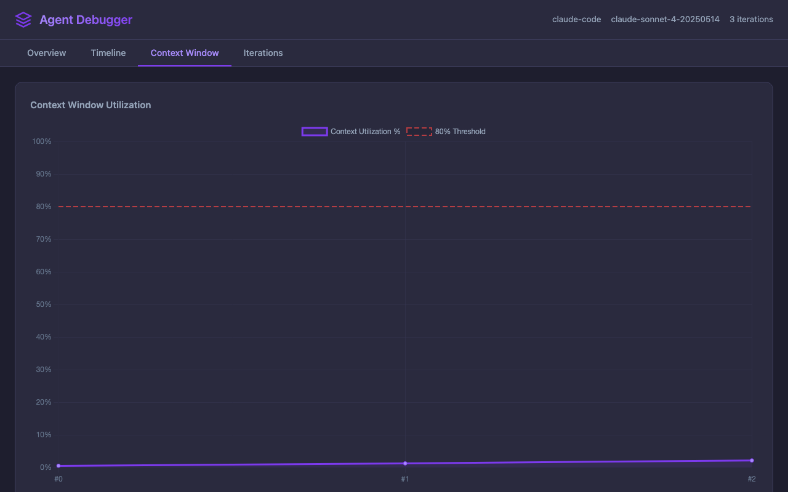

# Agent Debugger

> Iteration-level debugger for AI Agent loops — see where your Agent went off track and why.


## The Problem

Existing LLM observability tools (LangSmith, Langfuse, etc.) track **individual LLM calls**. But when debugging an AI Agent, the real question is: *"At which iteration did the Agent go off track, and why?"*

These tools show you a flat list of API calls with latencies and token counts. What they don't show you is the Agent's decision-making loop: how thinking evolved, which tools were called in what order, how the context window filled up, and where the reasoning went wrong.

Agent Debugger operates at the **Agent Loop iteration level** — giving you a structured timeline of think-act-observe cycles with full context window analysis.

## Features

- **Timeline View** — iteration-by-iteration breakdown of think/act/observe cycles
- **Context Window Analysis** — track utilization, growth rate, and detect token spikes
- **Cost Estimation** — input/output token costs per trace
- **Anomaly Detection** — automatic identification of token spikes and errors
- **Deep Inspection** — drill into any single iteration with full tool call details
- **Web UI** — dark-themed SPA with Overview, Timeline, Context Window, and Iterations tabs
- **Multi-Framework** — adapters for Claude Code (.jsonl), LangGraph/LangSmith (.json), and native JSON
- **Programmatic API** — use as a Python library, not just a CLI

## Quick Start

```bash
pip install agentloop-debugger
```

The CLI command is `agent-debugger` (also available as `agentloop-debugger`).

Or with [uv](https://docs.astral.sh/uv/):

```bash
uv add agentloop-debugger
```

Then point it at a trace file:

```bash
agent-debugger info examples/sample_trace.json
```

Output:
```
Source: native JSON
Agent: coding-assistant
Model: claude-sonnet-4-6
Iterations: 3
Total Tokens: 6,450

       Tool Calls
┌───────────┬───────┐
│ Tool      │ Count │
├───────────┼───────┤
│ read_file │   2   │
│ edit_file │   1   │
└───────────┴───────┘
```

## Commands

### `info` — Quick summary

```bash
agent-debugger info trace.json
```

Shows agent name, model, iteration count, total tokens, and tool call distribution.

### `timeline` — Iteration timeline

```bash
agent-debugger timeline trace.json
agent-debugger timeline trace.json --verbose
agent-debugger timeline trace.json --format json
```

Displays each iteration as a panel showing thinking (truncated), tool calls, token usage, and errors.

### `analyze` — Context window and cost analysis

```bash
agent-debugger analyze trace.json
agent-debugger analyze trace.json --max-context 128000
agent-debugger analyze trace.json --format json
```

Shows context utilization trend, token efficiency ratio, cost estimates, and detected anomalies.

### `inspect` — Deep dive into one iteration

```bash
agent-debugger inspect trace.json 2
agent-debugger inspect trace.json 0 --format json
```

Full detail of a single iteration: complete thinking text, tool arguments, results, token breakdown, and context window state.

### `serve` — Launch web UI

```bash
agent-debugger serve trace.json
agent-debugger serve trace.json --port 3000 --no-open
```

Opens an interactive web UI in your browser with tabs for Overview, Timeline, Context Window visualization, and per-Iteration inspection.

### `scan` — Discover local sessions

```bash
agent-debugger scan                    # list recent Claude Code sessions
agent-debugger scan --sort cost        # sort by estimated cost
agent-debugger scan --limit 5          # show top 5
```

Automatically scans `~/.claude/projects/` for Claude Code session files and displays a summary table.

### `diagnose` — Smart diagnostic report

```bash
agent-debugger diagnose trace.jsonl
```

Runs automated checks (context pressure, retry loops, cost hotspots, efficiency) and produces actionable recommendations with estimated savings.

### `diff` — Compare two traces

```bash
agent-debugger diff trace_v1.json trace_v2.json
```

Side-by-side comparison of iterations, tokens, cost, efficiency, and tool usage changes with color-coded deltas.

### CI Integration

```bash
agent-debugger analyze trace.json --fail-if-cost-above 1.0
agent-debugger analyze trace.json --fail-if-errors
agent-debugger analyze trace.json --fail-if-efficiency-below 0.05
```

Returns exit code 1 when thresholds are violated — use in CI pipelines to enforce quality gates.

## Supported Frameworks

| Framework | File Format | Auto-detected |
|-----------|-------------|---------------|
| Claude Code | `.jsonl` transcript | Yes |
| LangGraph / LangSmith | `.json` export | Yes |
| Native | `.json` (AgentTrace schema) | Yes |

Adapters auto-detect the file format. Just pass any supported file to any command.

## Web UI

```bash
agent-debugger serve trace.json
```



The web UI provides four tabs:

- **Overview** — summary stats, token distribution chart, tool usage breakdown
- **Timeline** — visual iteration cards with expand/collapse
- **Context Window** — utilization graph showing how context fills over iterations
- **Iterations** — detailed per-iteration view with full tool call inspection

<details>
<summary>Screenshots</summary>




</details>

## Programmatic Usage

```python
from agent_debugger import load_trace, TraceAnalyzer

# Load from any supported format (auto-detects adapter)
trace = load_trace("path/to/trace.json")

# Access structured data
print(f"Agent: {trace.agent_name}, Model: {trace.model}")
print(f"Iterations: {len(trace.iterations)}")

for iteration in trace.iterations:
    print(f"  [{iteration.index}] Tools: {[tc.name for tc in iteration.tool_calls]}")
    print(f"       Tokens: {iteration.token_usage.total_tokens}")

# Use the analyzer for higher-level insights
analyzer = TraceAnalyzer(trace)
print(f"Total tokens: {analyzer.total_tokens}")
print(f"Token efficiency: {analyzer.token_efficiency():.4f}")
print(f"Cost: ${analyzer.cost_estimate()['total_cost']:.6f}")

# Context window analysis
utilization = analyzer.context_utilization_trend(max_context=200000)
growth = analyzer.context_growth_rate()
```

## AgentTrace Schema

Agent Debugger uses a simple JSON format to describe Agent loop executions:

```json
{
  "agent_name": "my-agent",
  "model": "claude-sonnet-4-6",
  "start_time": "2025-01-15T10:30:00Z",
  "end_time": "2025-01-15T10:31:45Z",
  "iterations": [
    {
      "index": 0,
      "think": "I need to read the config file to understand the project structure...",
      "tool_calls": [
        {
          "name": "read_file",
          "arguments": {"path": "config.yaml"},
          "result": "database:\n  host: localhost\n  port: 5432",
          "duration_ms": 50
        }
      ],
      "observation": "Found the config file with database settings.",
      "token_usage": {
        "prompt_tokens": 1200,
        "completion_tokens": 150,
        "total_tokens": 1350
      },
      "context_window": {
        "used_tokens": 1350,
        "max_tokens": 200000
      },
      "duration_ms": 2500
    }
  ],
  "metadata": {}
}
```

Any Agent framework can export traces in this format. Use adapters for automatic conversion from Claude Code transcripts or LangGraph traces.

## Development

```bash
# Clone and install
git clone https://github.com/liwh9527/agent-debugger.git
cd agent-debugger
uv sync --dev

# Run tests
uv run pytest

# Lint
uv run ruff check src/ tests/

# Type check
uv run mypy src/agent_debugger/ --ignore-missing-imports
```

## Roadmap

- [x] AgentTrace JSON schema (Pydantic models)
- [x] CLI commands: `info`, `timeline`, `analyze`, `inspect`, `serve`
- [x] Context window usage visualization
- [x] Token cost estimation and anomaly detection
- [x] Framework adapters (Claude Code, LangGraph)
- [x] Web UI with interactive visualization
- [ ] Breakpoints & replay (step through iterations)
- [ ] Trace comparison (diff two runs)
- [ ] Streaming trace ingestion (live debugging)
- [ ] Additional adapters (CrewAI, AutoGen)
- [ ] VS Code extension

## License

MIT
